<!-- 
プロット

IoT開発の話でAWS IoTを活用したかった
→ 結局REST APIにしちゃったよね 😇 という話
→ 普段はAPI Gateway + Lambda + DynamoDBをよく使ってる

1. 作りたかったもの 🏢
   1. wifiがない環境でもデータをAWSに送りたい
2. AWS IoT との出会い 🤝
   1. 遡ることn年前、AWSコンソールでIoTの文字を見た
   2. 軽くAWS IoTの説明
3. M5Stack CAT-M/NB-IoT+GNSS ユニット ❤️ SORACOM Air
   1. この組み合わせ、行けるらしい
   2. 買っちった
4. SIM7080G 💔 AWS IoT ...?
   1. 動かしてみた (m5 wifi AWSIoT)
      1. Thing以外は基本terraformで作る
      2. ThingはDenoで登録しやすく
      3. mqtt動く！
   2. 動かしてみた (m5 LTE 適当なwebサイト)
      1. soracom cliで接続の確認
      2. HTTPリクエストできた！
   3. 動かしてみた (m5 LTE AWS IoT)
      1. だめで草
      2. ATコマンドで証明書をCAT-M/NB-IoTに入れるらしい
      3. 😇
5. ---------- ㊙️ ----------
   1. CAT-M/NB-IoT ❤️‍🩹 API Gateway
6. まとめ
   1. 諦めも肝心だよね
   2. とはいえ IoT Core 使えますって言いたいので誰か助けてください

 -->

<!-- _class: lead -->

# ==aws cli=={.aws-color} と ==soracom cli=={.soracom-color} を ==Deno=={.black} で<br/>うまくくっつけて<br/>IoT開発を楽にしたかった話

2026年1月17日
はるゆき (@haruyuki_16278)

<!-- _paginate: false -->

---


## 自己紹介

- **はるゆき** ==（山地 駿徹）=={.text-sm}
  - 香川県出身 → 就職で福井へ
  - 社会人5年目 **エンジニア**
  - 3年くらいWeb → 何でも屋
- **主な活動**
  - NTふくい ==(旧NT鯖江)=={.text-sm}
  - 技術書典
- 好きなサービス: ==AWS Lambda=={.aws-color}

---

## 話の流れ

1. 作りたかったもの 🏢
2. AWS IoT との出会い 🤝
3. M5Stack CAT-M/NB-IoT+GNSS ユニット ❤️ SORACOM Air
4. SIM7080G 💔 AWS IoT ...?
5. ---------- ㊙️ ----------
6. まとめ

---

## 話の流れ

1. **作りたかったもの 🏢**{.text-lg}
2. AWS IoT との出会い 🤝
3. M5Stack CAT-M/NB-IoT+GNSS ユニット ❤️ SORACOM Air
4. SIM7080G 💔 AWS IoT ...?
5. ---------- ㊙️ ----------
6. まとめ

---

<!-- header: 1. 作りたかったもの 🏢 -->

## 作りたかったもの 🏢

==マイコンで<br/>センシングしたくて...=={.text-xl5}

---

## 作りたかったもの 🏢

==取ったデータを<br/> ==AWS=={.aws-color} で使いたくて...=={.text-xl5}

---

## 作りたかったもの 🏢

==WiFiがない環境にも<br/>デバイスを置きたくて...=={.text-xl5}

---

:::_ {.text-xl5 .center .pt-1}
IoT やろう
:::

---

## 話の流れ

1. 作りたかったもの 🏢
2. **AWS IoT との出会い 🤝**{.text-lg}
3. M5Stack CAT-M/NB-IoT+GNSS ユニット ❤️ SORACOM Air
4. SIM7080G 💔 AWS IoT ...?
5. ---------- ㊙️ ----------
6. まとめ

---

<!-- header: 2. AWS IoT との出会い 🤝 -->

## AWS IoT との出会い 🤝

遡ること n年前...

---

## AWS IoT との出会い 🤝

遡ること n年前...

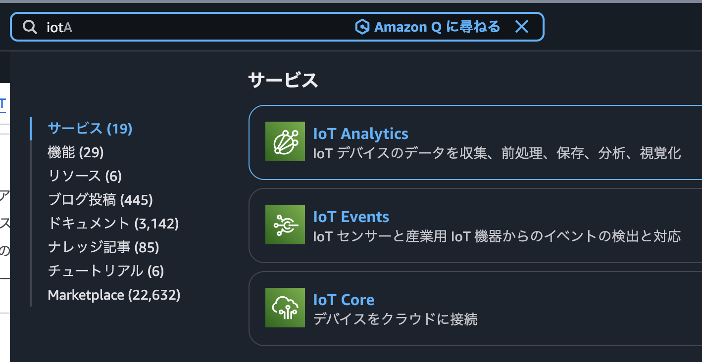

---

## AWS IoT との出会い 🤝

:::c


< ==IoT系のサービスもあるんやなぁ...🤔=={.text-xl2}
:::

---

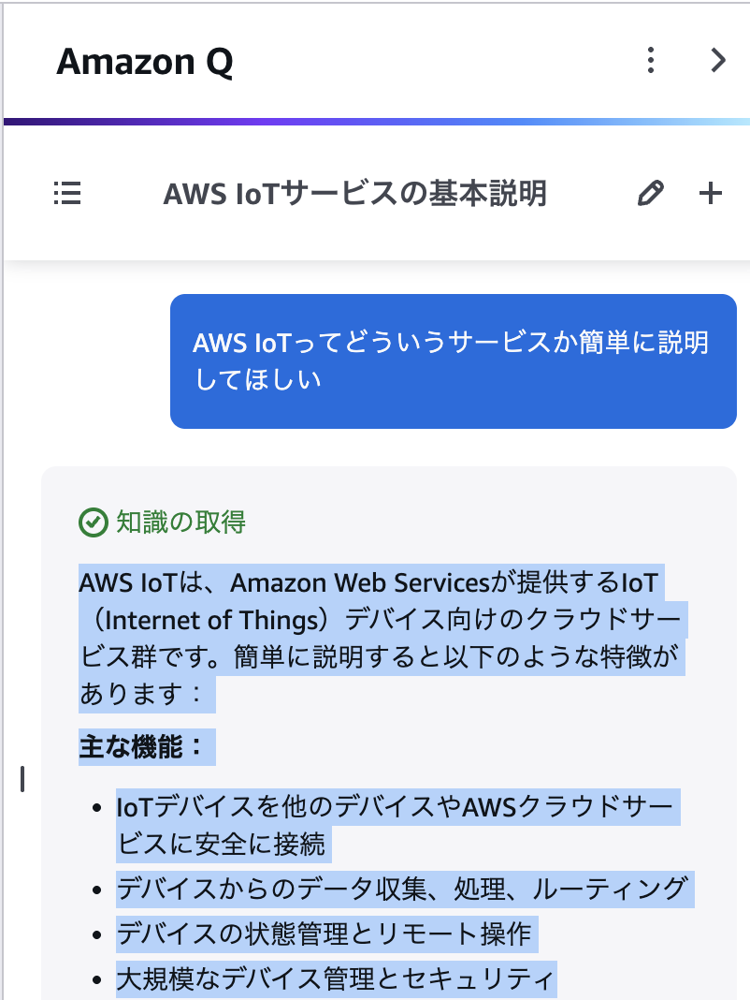

##  AWS IoT

IoTデバイスを**安全に**AWSと通信させたり、デバイスの管理や監視を行えたりする仲間

:::_ {.tip .mt-1}
AWS IoT系サービスは  
大阪リージョンでは  
(多分まだ)使えない
:::

---

###  AWS IoT Core

> IoTデバイスを**安全に**AWSと通信

↑この部分を担うサービス

- デバイスとAWS間で相互認証して安全に通信
- MQTT等で通信→必要に応じてほかサービスへ連携

---

### こんな感じ

:::_ {.center .pt-1}
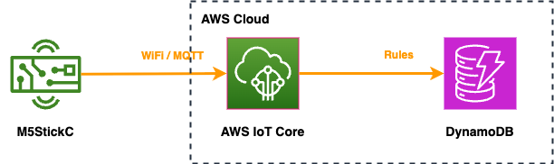
:::

---

:::_ {.text-xl5 .center .pt-1}
使ってみたい！
:::

---

## 話の流れ

1. 作りたかったもの 🏢
2. AWS IoT との出会い 🤝
3. **M5Stack CAT-M/NB-IoT+GNSS ユニット ❤️ SORACOM Air**{.text-lg}
4. SIM7080G 💔 AWS IoT ...?
5. ---------- ㊙️ ----------
6. まとめ

---

<!-- header: 3. M5Stack CAT-M/NB-IoT+GNSS ユニット ❤️ SORACOM Air -->

## M5Stack CAT-M/NB-IoT+GNSS ユニット ❤️ SORACOM Air

:::_ {.text-xl2 .center}
この組み合わせ、いけるらしい
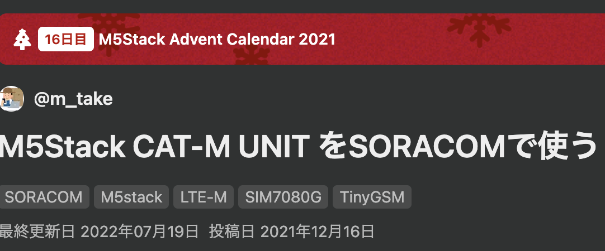
:::

---

### SORACOM

> IoTデバイス向けの「通信」と「クラウド」を融合させ、誰でも手軽かつセキュアにIoTシステムを構築・運用できるグローバルなプラットフォーム
>
> by ==Gemini=={.blue}

---

### こんな感じ

:::_ {.center .pt-1}
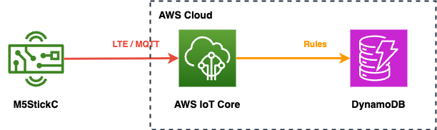
:::

---

### 買っちった 🛒

:::_ {.center .pt-1}
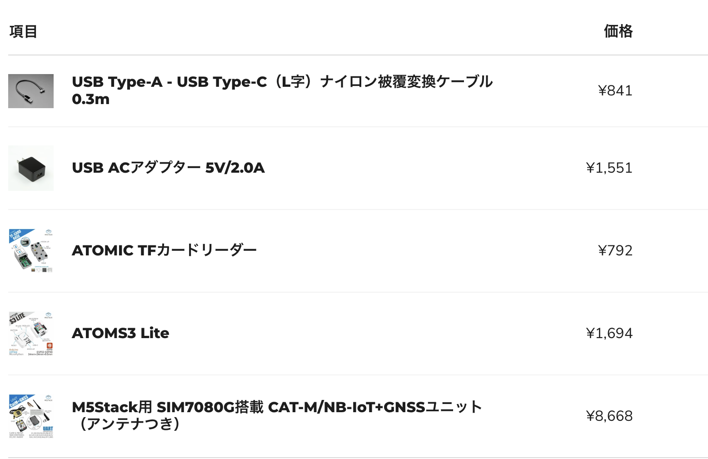
:::

---

### 買っちった 🛒

:::_ {.center .pt-1}
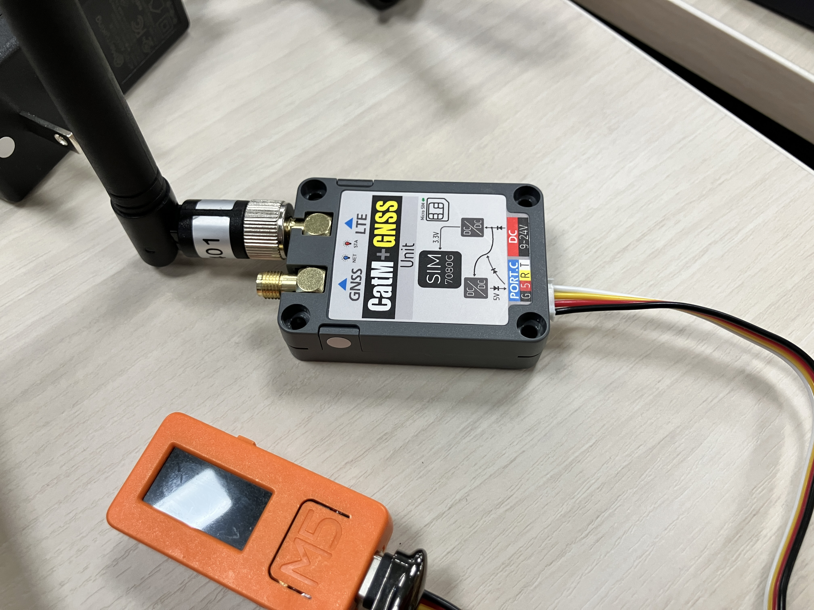
:::

---

### 買っちった 🛒

:::_ {.center .pt-1}
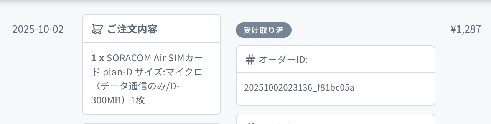
:::

---

## 話の流れ

1. 作りたかったもの 🏢
2. AWS IoT との出会い 🤝
3. M5Stack CAT-M/NB-IoT+GNSS ユニット ❤️ SORACOM Air
4. **SIM7080G 💔 AWS IoT ...?**{.text-lg}
5. ---------- ㊙️ ----------
6. まとめ

---

<!-- header: 4. SIM7080G 💔 AWS IoT ...? -->

## SIM7080G 💔 AWS IoT ...

:::_ {.text-xl2 .pt-1 .center}
とりあえず動かしてみよう

==💪=={.text-xl5}
:::

---

### 動かしてみた① (M5 + WiFi + AWS IoT)

Thing以外は基本terraformで作る

```terraform
resource "aws_iot_topic_rule" "save_to_dynamodb" {
  name        = "${replace(var.prefix, "-", "_")}_save_to_dynamodb"
  description = "IoTデータをDynamoDBに保存"
  enabled     = true
  sql         = "SELECT * FROM 'devices/+/data'"
  sql_version = "2016-03-23"

  dynamodbv2 {
    role_arn = aws_iam_role.iot_rule_role.arn
    put_item {
      table_name = var.dynamodb_data_table_name
    }
  }

  error_action {
    cloudwatch_logs {
      log_group_name = aws_cloudwatch_log_group.iot_errors.name
      role_arn       = aws_iam_role.iot_rule_role.arn
    }
  }
}
```

---

ThingはDenoで登録しやすく

```typescript
import { $ } from "jsr:@david/dax";
import { colors } from "jsr:@cliffy/ansi@1.0.0-rc.8/colors";
import { Confirm } from "jsr:@cliffy/prompt@^1.0.0-rc.8";
import { parseArgs } from "@std/cli/parse-args";

const POLICY_NAME = "m5-soraws_pubsub_anytopic";

const { name } = parseArgs(Deno.args);
if (!name) {
  throw new Error(`IoT Thing の name を与えてください。`);
}

// リポジトリルートに移動
const root = await $`git rev-parse --show-toplevel`.text();
Deno.chdir(root);

// 証明書を保存するディレクトリを作成
const certDir = `.certs/${name}`;
await $`mkdir -p ${certDir}`;

// aws cliを実行するプロファイルを取得
const awsProfileRaw =
  await $`aws configure list | grep -e profile -e region | awk '{print $2}'`
    .stdout("piped");
const [profile, region] = awsProfileRaw.stdout.replaceAll(" ", "").split("\n");

// 確認
const awsProfileOk = await Confirm.prompt(
  `次のaws-cliプロファイルを使用します: ${
    colors.green(profile === "<not" ? "default" : profile)
  }@${colors.cyan(region)}`,
);
if (!awsProfileOk) {
  console.log(colors.red("終了します"));
  Deno.exit(1);
}

const nameOk = await Confirm.prompt(
  `次の名前でIoT Thingを作成します: ${colors.green(name)}`,
);
const nameAlreadyUsed = (await $`aws iot list-things`.stdout("piped")).stdout
  .includes("name");
if (!nameOk || nameAlreadyUsed) {
  console.log(colors.red("終了します"));
  Deno.exit(1);
}

// aws cliでthingを作成
await $`aws iot create-thing --thing-name ${name}`.stdout("piped");
// 証明書を作成
await $`aws iot create-keys-and-certificate \
  --set-as-active \
  --certificate-pem-outfile ${certDir}/cert.pem \
  --private-key-outfile ${certDir}/private.key \
  --public-key-outfile ${certDir}/public.key
`.stdout("piped");
// 証明書ARNを取得
const certificateARN =
  (await $`aws iot list-certificates --query 'certificates[0].certificateArn' --output text`
    .stdout("piped")).stdout.trim();
console.log(colors.gray(certificateARN));
// アタッチ
await $`aws iot attach-policy --policy-name ${POLICY_NAME} --target ${certificateARN}`
  .stdout("piped");
await $`aws iot attach-thing-principal --thing-name ${name} --principal ${certificateARN}`
  .stdout("piped");

console.log(`IoT Thing として ${colors.green(name)} を登録しました。`);
```

---

ThingはDenoで登録しやすく

```typescript
// 前略

// aws cliでthingを作成
await $`aws iot create-thing --thing-name ${name}`.stdout("piped");
// 証明書を作成
await $`aws iot create-keys-and-certificate \
  --set-as-active \
  --certificate-pem-outfile ${certDir}/cert.pem \
  --private-key-outfile ${certDir}/private.key \
  --public-key-outfile ${certDir}/public.key
`.stdout("piped");
// 証明書ARNを取得
const certificateARN =
  (await $`aws iot list-certificates --query 'certificates[0].certificateArn' --output text`
    .stdout("piped")).stdout.trim();
console.log(colors.gray(certificateARN));
// アタッチ
await $`aws iot attach-policy --policy-name ${POLICY_NAME} --target ${certificateARN}`
  .stdout("piped");
await $`aws iot attach-thing-principal --thing-name ${name} --principal ${certificateARN}`
  .stdout("piped");
```

---

### arduino-cli

```shell
python:3.12.7
node:v22.13.0
haruyuki@hailstorm 13:50:56 土 17 ~/private/m5-soraws/device master
% arduino-cli compile --fqbn esp32:esp32:m5stack_stickc wifi-mqtt
最大3145728バイトのフラッシュメモリのうち、スケッチが1079087バイト（34%）を使っています。
最大327680バイトのRAMのうち、グローバル変数が48072バイト（14%）を使っていて、ローカル変数で279608バイト使うことができます。

python:3.12.7
node:v22.13.0
haruyuki@hailstorm 13:53:38 土 17 ~/private/m5-soraws/device master
% arduino-cli upload -p /dev/cu.usbserial-B552A7EA45 --fqbn esp32:esp32:m5stack_stickc wifi-mqtt
esptool v5.1.0
Connected to ESP32 on /dev/cu.usbserial-B552A7EA45:
Chip type:          ESP32-PICO-D4 (revision v1.0)
Features:           Wi-Fi, BT, Dual Core + LP Core, 240MHz, Embedded Flash, Vref calibration in eFuse, Coding Scheme None
Crystal frequency:  40MHz
MAC:                d8:a0:1d:50:f5:00

Stub flasher running.
Changing baud rate to 1500000...
Changed.

Configuring flash size...
Flash will be erased from 0x00001000 to 0x00007fff...
Flash will be erased from 0x00008000 to 0x00008fff...
Flash will be erased from 0x0000e000 to 0x0000ffff...
Flash will be erased from 0x00010000 to 0x00117fff...
Wrote 25184 bytes (16079 compressed) at 0x00001000 in 0.6 seconds (344.9 kbit/s).
Hash of data verified.
Wrote 3072 bytes (137 compressed) at 0x00008000 in 0.1 seconds (438.4 kbit/s).
Hash of data verified.
Wrote 8192 bytes (47 compressed) at 0x0000e000 in 0.1 seconds (584.5 kbit/s).
Hash of data verified.
Wrote 1079232 bytes (687982 compressed) at 0x00010000 in 10.0 seconds (862.6 kbit/s).
Hash of data verified.

Hard resetting via RTS pin...
New upload port: /dev/cu.usbserial-B552A7EA45 (serial)
```

---

### mqtt動く！ ✅

:::_ {.center}
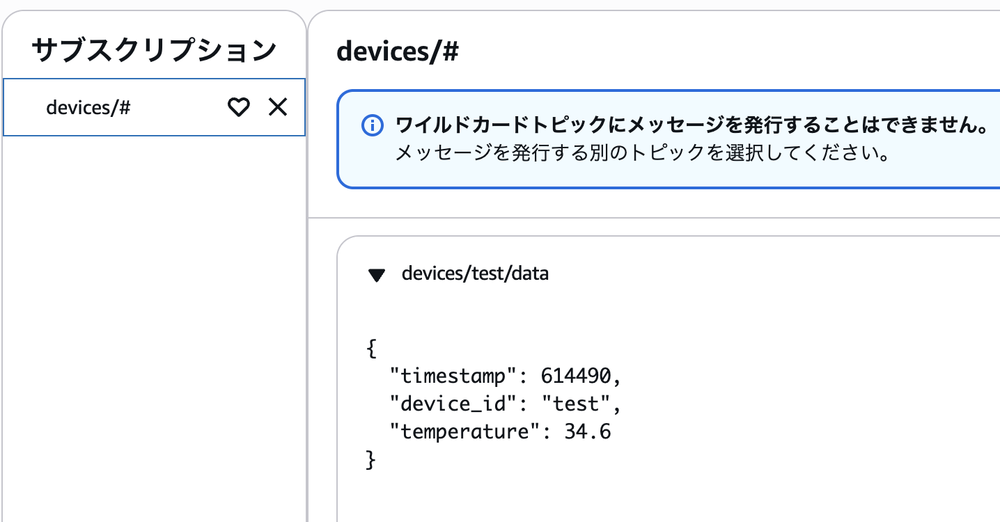
:::

---

### 動かしてみた② (M5 + LTE + 適当なWebサイト)

:::_ {.text-xl2 .center}
動いた！
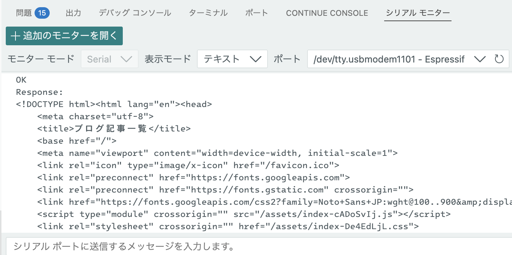
:::

---

### 動かしてみた③ (M5 + LTE + AWS IoT)

:::_ {.text-xl2 .pt-1 .center}
==❌=={.text-xl5}

適当に作るだけだとぜ〜んぜん動かない
:::

---

### 何がダメだったのか

#### MQTTS 対応

ATコマンドで証明書をCAT-M/NB-IoTモジュール(SIM7080G)に入れる必要があった

ATコマンド... 🤔 ❓

---

## 話の流れ

1. 作りたかったもの 🏢
2. AWS IoT との出会い 🤝
3. M5Stack CAT-M/NB-IoT+GNSS ユニット ❤️ SORACOM Air
4. SIM7080G 💔 AWS IoT ...?
5. **---------- ㊙️ ----------**{.text-lg}
6. まとめ

---

## 話の流れ

1. 作りたかったもの 🏢
2. AWS IoT との出会い 🤝
3. M5Stack CAT-M/NB-IoT+GNSS ユニット ❤️ SORACOM Air
4. SIM7080G 💔 AWS IoT ...?
5. **CAT-M/NB-IoT ❤️‍🩹 API Gateway**{.text-lg}
6. まとめ

---

<!-- header: 5. CAT-M/NB-IoT ❤️‍🩹 API Gateway -->

### CAT-M/NB-IoT ❤️‍🩹 API Gateway

<!-- TODO: AWS IoT Core を諦めて、API Gateway 経由に変更した話 -->

:::_ {.center .pt-1}
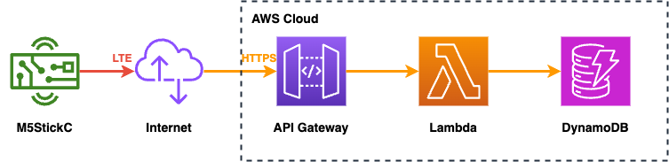

==こうなっちゃった 🤪=={.text-xl2}
:::

---

<!-- header: 6. まとめ -->

## まとめ

- **諦めも肝心だよね** 😅
  - 諦めたあと 二の矢 を用意しやすいので==AWS=={.aws-color}はいいぞ
- **とはいえ...**
  - LTE で AWS IoT 使えますって言いたい！
    - 誰か助けてください 🙏

---

<!-- header: 6. まとめ -->

## まとめ

:::_ {.text-sm}

- **諦めも肝心だよね** 😅
  - 諦めたあと 二の矢 を用意しやすいので==AWS=={.aws-color}はいいぞ
- **とはいえ...**
  - LTE で AWS IoT 使えますって言いたい！
    - 誰か助けてください 🙏

:::

:::_ {.text-xs}

*（これAWSっていうかM5 CatM Unitのハマりじゃない...?）
*（勉強と思ってやってたけど結局採用されなかったからサ...）
*（ホントはsoracom cliからsimID取り出してaws cliでiot thing登録してDenoでArduinoソース中のトークンを置き換えてarduino cliでコンパイルしてアップロードして....という話をする予定でした）
*（てか昨日資料準備してるときに興が乗ってLTE+MQTT開発してたのに電源系のなんかで動かんくて草）

:::

---

<!-- header: "" -->
<!-- _class: lead -->

## ご清聴ありがとうございました！

質問・助言お待ちしています 🙇
